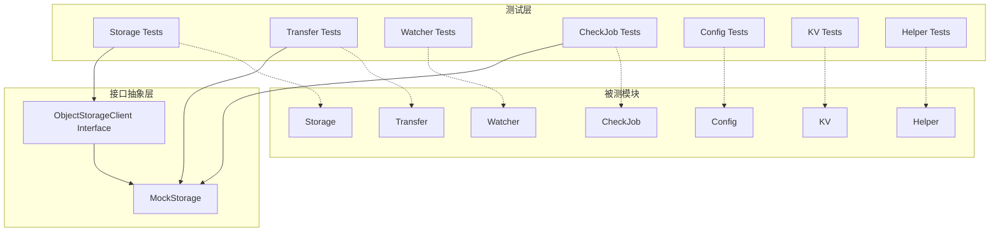
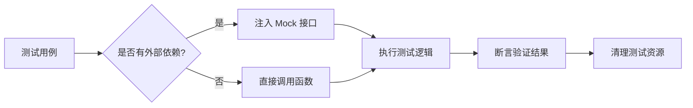

## 产品概述

为 rsync-object-storage 项目建立完备的单元测试体系，确保核心模块的代码质量和稳定性。测试方案采用接口抽象和 Mock 实现，隔离外部依赖（如 S3 对象存储），实现纯本地单元测试。

## 核心功能

- **Storage 模块测试**：抽象 S3 客户端接口，使用 Mock 实现测试上传、删除、对象比较等操作
- **Transfer 模块测试**：测试文件同步执行器的 Put/Delete 队列消费逻辑
- **Watcher 模块测试**：测试文件系统监听和事件分发功能
- **CheckJob 模块测试**：测试定时对账任务的调度和文件差异检测
- **Config 模块测试**：测试配置文件解析、路径规范化、参数校验
- **KV 模块测试**：测试 TTL 缓存的 Set/Get/Exists/Delete 及过期清理
- **Helper 模块测试**：测试文件操作、字符串处理、忽略规则匹配、MD5 缓存等辅助函数

## 技术栈

- 语言版本：Go 1.21
- 测试框架：Go 标准库 `testing`
- Mock 库：`github.com/stretchr/testify/mock`（用于接口 Mock）
- 断言库：`github.com/stretchr/testify/assert`（简化测试断言）
- 现有依赖：minio-go/v7、fsnotify、zap

## 技术架构

### 系统架构



### 模块划分

| 模块 | 测试文件 | 测试策略 | 依赖处理 |
| --- | --- | --- | --- |
| Storage | `storage_test.go` | 接口抽象 + Mock | Mock S3 Client |
| Transfer | `transfer_test.go` | 注入 Mock Storage | Mock Storage 接口 |
| Watcher | `watcher_test.go` | 临时目录 + 真实 fsnotify | 无外部依赖 |
| CheckJob | `checkjob_test.go` | 注入 Mock Storage | Mock Storage 接口 |
| Config | `config/config_test.go` | 临时配置文件 | 无外部依赖 |
| KV | `kv/kv_test.go` | 直接测试 | 使用 ResetForTest |
| Helper | `helper/*_test.go` | 临时文件系统 | 无外部依赖 |


### 数据流



## 实现细节

### 核心目录结构

```
project-root/
├── storage.go
├── storage_interface.go      # 新增：S3 客户端接口定义
├── storage_test.go           # 新增：Storage 单元测试
├── transfer.go
├── transfer_test.go          # 新增：Transfer 单元测试
├── watcher.go
├── watcher_test.go           # 新增：Watcher 单元测试
├── checkjob.go
├── checkjob_test.go          # 新增：CheckJob 单元测试
├── mocks/
│   └── mock_storage.go       # 新增：Mock Storage 实现
├── config/
│   ├── config.go
│   └── config_test.go        # 新增：Config 单元测试
├── kv/
│   ├── kv.go
│   └── kv_test.go            # 新增：KV 单元测试
├── helper/
│   ├── file.go
│   ├── file_test.go          # 新增：文件操作测试
│   ├── string.go
│   ├── string_test.go        # 新增：字符串处理测试
│   ├── ignore.go
│   ├── ignore_test.go        # 新增：忽略规则测试
│   ├── md5cache.go
│   └── md5cache_test.go      # 新增：MD5缓存测试
└── go.mod                    # 修改：添加 testify 依赖
```

### 关键代码结构

**ObjectStorageClient 接口**：抽象 S3 操作，便于 Mock 替换

```
// storage_interface.go
type ObjectStorageClient interface {
    ListBuckets(ctx context.Context) ([]minio.BucketInfo, error)
    BucketExists(ctx context.Context, bucket string) (bool, error)
    StatObject(ctx context.Context, bucket, object string, opts minio.StatObjectOptions) (minio.ObjectInfo, error)
    FPutObject(ctx context.Context, bucket, object, filePath string, opts minio.PutObjectOptions) (minio.UploadInfo, error)
    RemoveObject(ctx context.Context, bucket, object string, opts minio.RemoveObjectOptions) error
    ListObjects(ctx context.Context, bucket string, opts minio.ListObjectsOptions) <-chan minio.ObjectInfo
    RemoveObjects(ctx context.Context, bucket string, objectsCh <-chan minio.ObjectInfo, opts minio.RemoveObjectsOptions) <-chan minio.RemoveObjectError
}
```

**MockObjectStorageClient**：testify/mock 实现的 Mock 对象

```
// mocks/mock_storage.go
type MockObjectStorageClient struct {
    mock.Mock
}

func (m *MockObjectStorageClient) StatObject(ctx context.Context, bucket, object string, opts minio.StatObjectOptions) (minio.ObjectInfo, error) {
    args := m.Called(ctx, bucket, object, opts)
    return args.Get(0).(minio.ObjectInfo), args.Error(1)
}
// ... 其他方法实现
```

**Storage 结构体改造**：使用接口替代具体类型

```
// storage.go 改造
type Storage struct {
    Client       ObjectStorageClient  // 改为接口类型
    Bucket       string
    LocalPrefix  string
    RemotePrefix string
    SymLink      string
}
```

### 技术实现计划

#### 1. Storage 接口抽象

- 问题：Storage 直接依赖 minio.Client，无法 Mock
- 方案：定义 ObjectStorageClient 接口，Storage 使用接口而非具体类型
- 技术：Go interface + testify/mock
- 步骤：

1. 创建 storage_interface.go 定义接口
2. 修改 Storage 结构体使用接口
3. 创建 mocks/mock_storage.go 实现 Mock
4. 编写 storage_test.go 测试用例

#### 2. Helper 模块测试

- 问题：文件系统操作需要真实文件
- 方案：使用 os.MkdirTemp 创建临时测试目录
- 步骤：

1. 测试 IsDir/IsExist/IsSymlink 等文件判断函数
2. 测试 FileMd5/FileSha256 哈希计算
3. 测试 IsIgnore/IgnoreMatcher 忽略规则
4. 测试 HideSecret/RandomString 字符串处理

### 测试覆盖目标

| 模块 | 预期覆盖率 | 重点测试场景 |
| --- | --- | --- |
| Storage | 80%+ | FPutObject、RemoveObject、IsSameV2、GetRemotePath |
| Transfer | 75%+ | Put/Delete 队列消费、Context 取消 |
| Watcher | 70%+ | Add、事件处理、热点延迟 |
| CheckJob | 75%+ | 调度逻辑、Walk 对账 |
| Config | 85%+ | 路径规范化、参数校验 |
| KV | 90%+ | TTL 过期、并发安全 |
| Helper | 90%+ | 所有辅助函数 |


## Agent Extensions

### SubAgent

- **code-explorer**
- 用途：在实现过程中需要搜索和理解现有代码结构时使用
- 预期结果：快速定位需要修改或参考的代码位置