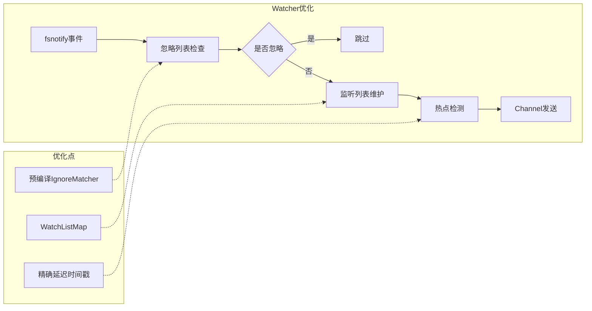
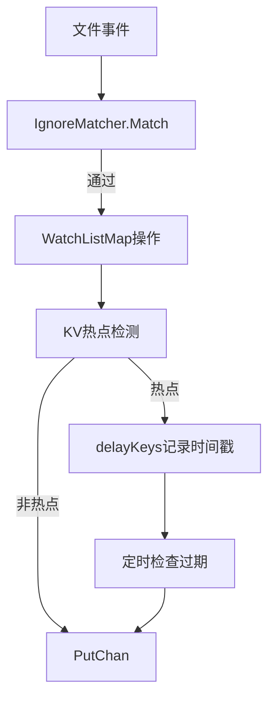

## 产品概述

针对 rsync-object-storage 项目的 Watcher 模块进行性能优化，解决监听效率和资源竞争问题，提升大规模文件同步场景下的系统响应速度和资源利用率。

## 核心功能

- 监听列表查找优化：将 O(n) 的数组遍历优化为 O(1) 的 Map 查找
- 忽略列表检查加速：预编译忽略规则，降低每次检查的计算开销
- KV 锁竞争优化：采用分片锁或 sync.Map 替代全局 Mutex，减少锁争用
- 热点延迟精确控制：为每个热点文件记录独立时间戳，实现精确的延迟触发
- MD5 缓存机制：缓存文件 MD5 值，避免重复计算
- Channel 缓冲调优：根据实际负载调整 PutChan 和 DeleteChan 缓冲大小

## 技术栈

- 语言：Go 1.21
- 核心依赖：fsnotify（文件监听）、minio-go（S3 存储）、zap（日志）
- 并发模型：goroutine + channel + sync 包

## 技术架构

### 系统架构

本次优化聚焦于 Watcher 和相关模块的性能改进，不改变现有架构模式。



### 模块划分

- **helper/ignore.go**：新增忽略规则预编译器，提供 O(1) 匹配检查
- **kv/kv.go**：优化为分片锁或 sync.Map，降低锁竞争
- **watcher.go**：新增 WatchListMap 维护监听列表，优化热点延迟机制
- **storage.go**：新增 MD5 缓存层，避免重复计算
- **main.go**：调整 Channel 缓冲参数

### 数据流



## 实现细节

### 核心目录结构

```
project-root/
├── helper/
│   ├── file.go           # 修改：IsIgnore 使用 IgnoreMatcher
│   └── ignore.go         # 新增：IgnoreMatcher 预编译忽略规则
├── kv/
│   └── kv.go             # 修改：使用 sync.Map 替代 Mutex
├── watcher.go            # 修改：WatchListMap + 精确延迟控制
├── storage.go            # 修改：MD5 缓存机制
└── main.go               # 修改：Channel 缓冲调优
```

### 关键代码结构

**IgnoreMatcher 结构**：预编译忽略规则，支持目录模式、文件名和通配符的快速匹配。

```
// helper/ignore.go
type IgnoreMatcher struct {
    dirPatterns  map[string]struct{} // 目录模式集合
    filePatterns map[string]struct{} // 文件名精确匹配
    globPatterns []string            // 通配符模式
}

func NewIgnoreMatcher(ignoreList []string) *IgnoreMatcher
func (m *IgnoreMatcher) Match(path string) bool
```

**KV 优化方案**：使用 sync.Map 替代 sync.Mutex，消除全局锁竞争。

```
// kv/kv.go 优化后
type KV struct {
    items sync.Map // map[interface{}]*Item
}
```

**WatchListMap**：维护监听列表的 Map 结构，支持 O(1) 查找和子目录快速匹配。

```
// watcher.go
type Watcher struct {
    // ... 现有字段
    watchListMap sync.Map // map[string]struct{} 监听路径集合
}
```

**精确延迟控制**：记录每个热点文件的首次触发时间戳，实现精确延迟触发。

```
// watcher.go delayKeys 结构优化
type delayItem struct {
    firstSeen time.Time
}
// delayKeys sync.Map 存储 path -> delayItem
```

**MD5 缓存结构**：基于文件路径和修改时间的缓存键，避免重复计算。

```
// storage.go 或 helper/md5cache.go
type MD5Cache struct {
    cache sync.Map // map[string]*cacheEntry
}

type cacheEntry struct {
    md5     string
    modTime time.Time
    size    int64
}
```

### 技术实现计划

**1. 监听列表优化（高优先级）**

- 问题：watcher.go:130 遍历 WatchList() 数组，O(n) 复杂度
- 方案：维护 sync.Map 类型的 watchListMap，Add 时同时写入，Remove/Rename 时 O(1) 查找
- 步骤：

1. 在 Watcher 结构体添加 watchListMap sync.Map
2. 在 Add 方法中同步更新 watchListMap
3. 替换 Remove/Rename 处理逻辑，使用 Map 查找

- 测试：验证大量监听目录时的性能提升

**2. 忽略列表检查优化（中优先级）**

- 问题：helper/file.go:63-83 每次调用 O(n) 遍历
- 方案：创建 IgnoreMatcher，预编译规则，目录和文件名使用 Map 存储
- 步骤：

1. 新建 helper/ignore.go 定义 IgnoreMatcher
2. 在 Watcher 初始化时创建 IgnoreMatcher 实例
3. 修改 IsIgnore 调用为 IgnoreMatcher.Match

- 测试：验证忽略规则匹配正确性和性能

**3. KV 锁竞争优化（中优先级）**

- 问题：kv/kv.go 使用 sync.Mutex 全局锁，高并发下竞争严重
- 方案：使用 sync.Map 替代，利用其内置的读写优化
- 步骤：

1. 将 items map 替换为 sync.Map
2. 重构 set/get/delete/contains 方法
3. 优化 clean 方法的遍历逻辑

- 测试：验证并发读写性能

**4. 热点延迟精确控制（中优先级）**

- 问题：watcher.go:143-151 使用固定 ticker，无法精确控制每个文件的延迟时间
- 方案：记录每个热点文件的首次触发时间，检查时计算实际延迟
- 步骤：

1. 修改 delayKeys 存储结构为 path -> delayItem{firstSeen}
2. 在 ticker 处理中检查 time.Since(firstSeen) >= HotDelay
3. 未到期的项保留，到期的发送到 PutChan

- 测试：验证延迟时间精确性

**5. MD5 缓存机制（中优先级）**

- 问题：storage.go:283-285 每次比较都计算 MD5，IO 密集
- 方案：基于文件路径+修改时间+大小作为缓存键
- 步骤：

1. 创建 MD5Cache 结构和全局实例
2. 在 FileMd5 调用前检查缓存
3. 缓存命中时直接返回，未命中则计算并缓存

- 测试：验证缓存命中率和一致性

**6. Channel 缓冲调优（中优先级）**

- 问题：main.go:41-42 PutChan=64, DeleteChan=16 可能不足
- 方案：根据 Worker 数量和负载特征调整
- 步骤：

1. PutChan 调整为 256（8 Worker * 32）
2. DeleteChan 调整为 64（删除操作较少但批量多）
3. 添加配置支持动态调整

- 测试：监控 Channel 阻塞情况

### 集成点

- IgnoreMatcher 需在 Watcher 和 CheckJob 中共享使用
- MD5Cache 需在 Storage 的 IsSameV2 和 FPutObject 中使用
- 所有优化需确保优雅退出机制正常工作

## 技术考量

### 性能优化

- 监听列表 Map 化：O(n) -> O(1)，监听 10000 目录时性能提升显著
- 忽略规则预编译：减少每次事件的字符串处理开销
- sync.Map 替代 Mutex：读多写少场景下减少锁等待

### 内存考量

- MD5 缓存需设置合理的过期时间和容量上限，防止内存膨胀
- IgnoreMatcher 内存占用与忽略规则数量成正比，通常可忽略

### 兼容性

- 所有优化保持现有 API 和配置兼容
- 日志输出格式保持一致

## Agent Extensions

### Integration

- **anydev**
- 用途：项目优化完成后，可部署到腾讯云开发环境进行测试验证
- 预期结果：成功部署并运行性能测试